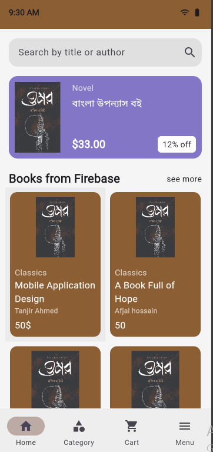
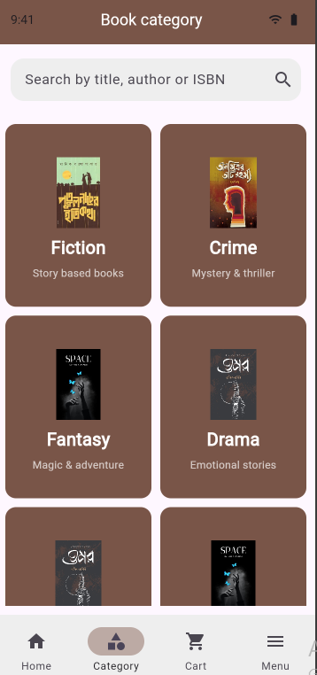
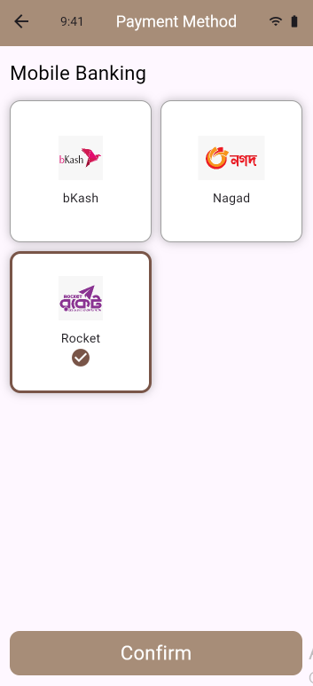
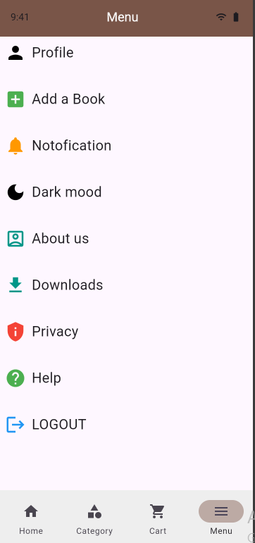
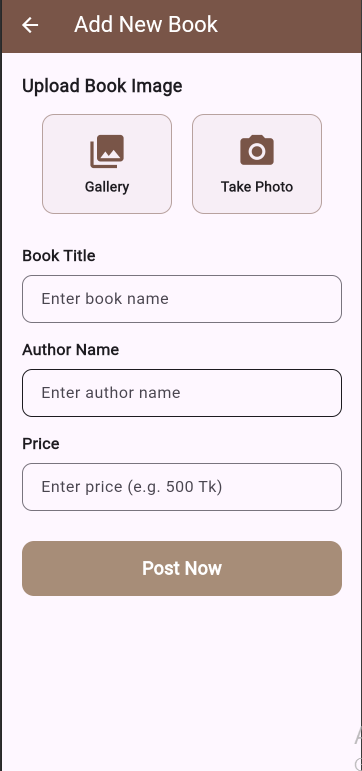

# Book Selling Project

## Book Store App is designed to provide a seamless digital platform for users to browse, select, and purchase books easily, while integrating Firebase for secure authentication, real-time data management, and smooth user experience.

<p align="center">
  
   
  
  
  
  
  
</p>

## Design (Figma)
🔗 [View Figma Design](https://www.figma.com/design/yqtJEg4fTHrXUebyvOarDP/software?node-id=0-1&t=CuSa5RksMHVlFnTZ-0)

## ✨ Features

- 📖 Browse books by category  
- 🔍 Search and filter system  
- 🛒 Add to cart functionality  
- 💳 Simple payment system  
- 🔐 Firebase Authentication  
- ☁️ Real-time Database  
- 📱 Clean & responsive UI  

## 🛠️ Tech Stack

- Flutter  
- Dart  
- Firebase (Authentication & Database)  

## ⚙️ Installation

```bash
git clone https://github.com/afjalhossain31/Book-Selling-App.git
cd your-repo
flutter pub get
flutter run